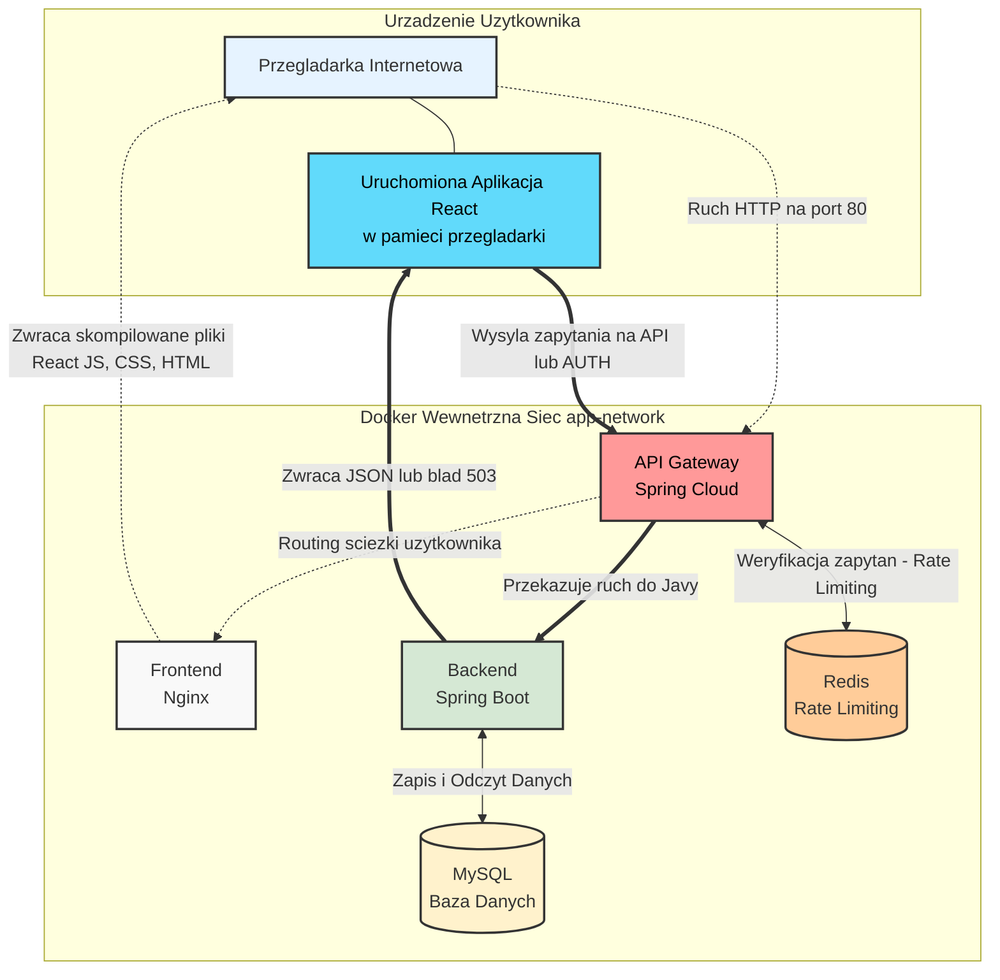

# Music Browser - System Zarządzania Muzyką

## 1. Architektura Systemu

Zgodnie z wymaganiami projektu, poniżej przedstawiono architekturę aplikacji:

* **API Gateway**: Mikroserwis bazujący na Spring Cloud Gateway. Służy jako pojedynczy punkt wejścia, zajmuje się routingiem, limitowaniem zapytań (Rate Limiting) oraz obsługą awarii (Circuit Breaker).
* **Frontend**: Aplikacja Single Page Application (SPA) oparta na React + Vite, serwowana przez Nginx (obraz unprivileged).
* **Backend**: Mikroserwis REST API zbudowany w Spring Boot 3, wykorzystujący Java 21 i Maven.
* **Database (MySQL)**: Baza danych 8.0 do przechowywania informacji o użytkownikach, piosenkach i playlistach.
* **Cache (Redis)**: Baza in-memory wspierająca działanie mechanizmu Rate Limitingu na bramie API, cache'uje dane dotyczące playlist.



> **Zadanie 1.6**: Graficzna reprezentacja architektury wygenerowana przez `compose-viz` znajduje się w pliku `architektura.png`.

## 2. Repozytoria DockerHub

Obrazy są budowane jako wieloarchitekturowe (`linux/amd64`, `linux/arm64`) i zawierają wbudowane informacje SBOM.

* **Api Gateway**: [Link do DockerHub - pitaodkebaba/apigateway](https://hub.docker.com/r/pitaodkebaba/api-gateway)
* **Backend**: [Link do DockerHub - pitaodkebaba/backend](https://hub.docker.com/r/pitaodkebaba/backend)
* **Frontend**: [Link do DockerHub - pitaodkebaba/frontend](https://hub.docker.com/r/pitaodkebaba/frontend)
* **Database**: [Link do DockerHub - pitaodkebaba/database](https://hub.docker.com/r/pitaodkebaba/database)

## 3. Pliki Dockerfile i Dobre Praktyki

Wszystkie obrazy zostały opracowane zgodnie z wytycznymi bezpieczeństwa i optymalizacji:

* **Multi-stage builds**: Oddzielenie etapu budowania od etapu uruchamiania (mniejszy rozmiar obrazu).
* **Lekkie obrazy bazowe**: Wykorzystanie dystrybucji Alpine Linux i Temurin.
* **Bezpieczeństwo (Non-root)**: Uruchamianie procesów jako użytkownicy o niskich uprawnieniach.

## 4. Analiza Podatności (Trivy)

Obrazy zostały poddane skanowaniu na obecność luk w zabezpieczeniach narzędziem Trivy.
Szczegółowe raporty i uzasadnienia dla ewentualnych podatności znajdują się w plikach:

* `backend_scan.md`
* `gateway_scan.md`
* `apigateway_scan.md`
* `database_scan.md`

## 5. SBOM (Software Bill of Materials)

Informacje SBOM zostały osadzone w obrazach za pomocą flagi `--sbom=true`. Dowód obecności manifestu można zweryfikować komendą:
`docker buildx imagetools inspect pitaodkebaba/backend:latest`

## 6. Uruchomienie deweloperskie

Aplikację można uruchomić lokalnie za pomocą Docker Compose:

```bash
docker-compose up -d
```

Frontend dostępny jest pod adresem: `http://localhost`
Backend (API): Ruch kierowany przez Gateway, np. `http://localhost/api/songs` lub `http://localhost/auth/login`. Bezpośredni port 8080 do backendu jest celowo zamknięty dla bezpieczeństwa hosta.

## 7. Dodatkowe Zabezpieczenia API Gateway

W ramach podnoszenia poziomu bezpieczeństwa procesów integracji i środowiska rozproszonego, wprowadzono następujące mechanizmy ochronne na bramie API:

* **Rate Limiting**: Używając bazy Redis, nałożono limit żądań na ścieżki logowania i rejestracji `(/auth/**)`, co skutecznie zapobiega atakom słownikowym (brute-force) oraz obciążeniowym (DDoS). Po przekroczeniu limitu system natychmiast zwraca `429 Too Many Requests`.
* **Circuit Breaker (Bezpiecznik)**: Wykorzystując bibliotekę Resilience4j, Gateway monitoruje stan backendu. W przypadku awarii lub timeoutu, brama odcina ruch i serwuje sformatowaną odpowiedź zapasową (Fallback) ze statusem `503 Service Unavailable`, zapobiegając kaskadowym awariom systemu. Frontend jest przygotowany do przechwytywania i wyświetlania tego błędu użytkownikowi.
