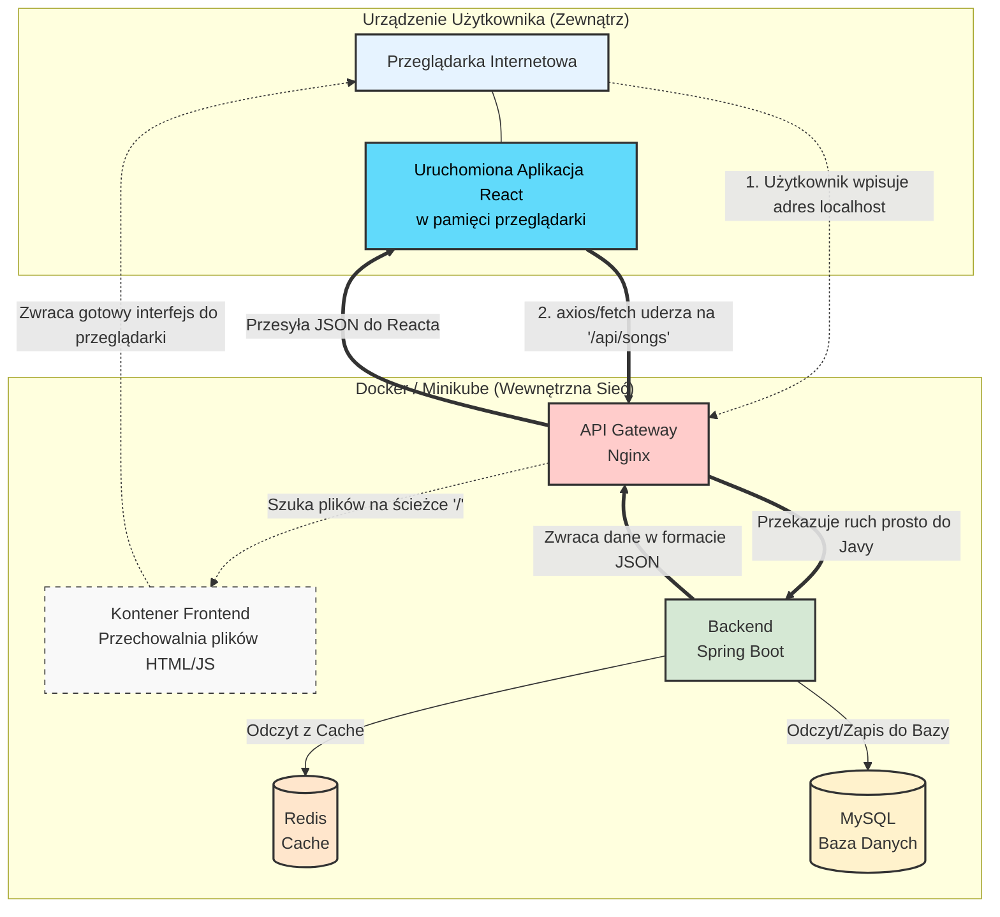

# Music Browser - System Zarządzania Muzyką

## 1. Architektura Systemu

Zgodnie z wymaganiami projektu, poniżej przedstawiono architekturę aplikacji:

* **Frontend**: Aplikacja Single Page Application (SPA) oparta na React + Vite, serwowana przez Nginx (obraz unprivileged).
* **Backend**: Mikroserwis REST API zbudowany w Spring Boot 3, wykorzystujący Java 21 i Maven.
* **Database**: Baza danych MySQL 8.0 do przechowywania informacji o użytkownikach, piosenkach i playlistach.



> **Zadanie 1.6**: Graficzna reprezentacja architektury wygenerowana przez `compose-viz` znajdzie się w pliku `architektura.png`.

## 2. Repozytoria DockerHub

Obrazy są budowane jako wieloarchitekturowe (`linux/amd64`, `linux/arm64`) i zawierają wbudowane informacje SBOM.

* **Backend**: [Link do DockerHub - pitaodkebaba/backend](https://hub.docker.com/r/pitaodkebaba/backend)
* **Frontend**: *(Link zostanie dodany po przesłaniu obrazu)*
* **Database**: *(Link zostanie dodany po przesłaniu obrazu)*

## 3. Pliki Dockerfile i Dobre Praktyki

Wszystkie obrazy zostały opracowane zgodnie z wytycznymi bezpieczeństwa i optymalizacji:

* **Multi-stage builds**: Oddzielenie etapu budowania od etapu uruchamiania (mniejszy rozmiar obrazu).
* **Lekkie obrazy bazowe**: Wykorzystanie dystrybucji Alpine Linux i Temurin.
* **Bezpieczeństwo (Non-root)**: Uruchamianie procesów jako użytkownicy o niskich uprawnieniach.

## 4. Analiza Podatności (Trivy)

## 5. SBOM (Software Bill of Materials)

Informacje SBOM zostały osadzone w obrazach za pomocą flagi `--sbom=true`. Dowód obecności manifestu można zweryfikować komendą:
`docker buildx imagetools inspect pitaodkebaba/backend:latest`

## 6. Uruchomienie deweloperskie

Aplikację można uruchomić lokalnie za pomocą Docker Compose:

```bash
docker-compose up -d
```

Frontend dostępny jest pod adresem: `http://localhost`  
Backend (API) dostępny jest pod adresem: `http://localhost:8080`
